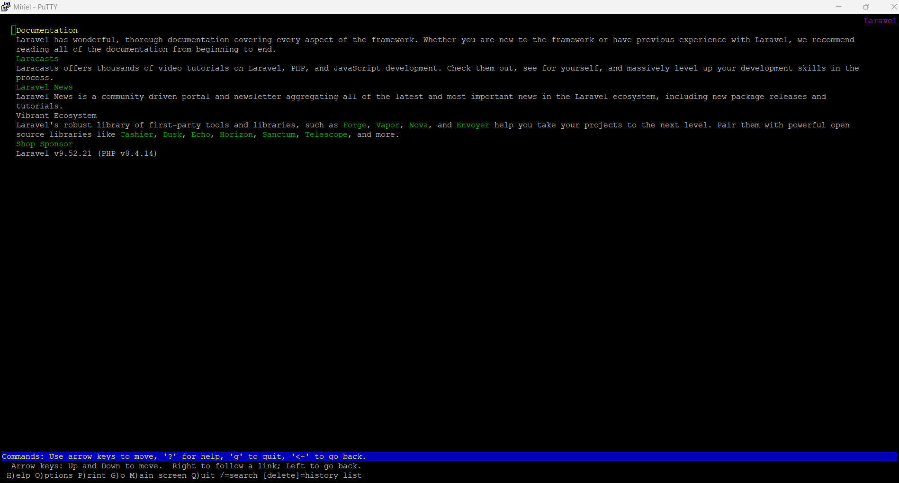
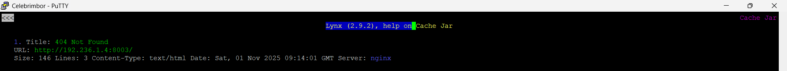
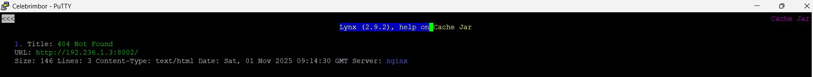
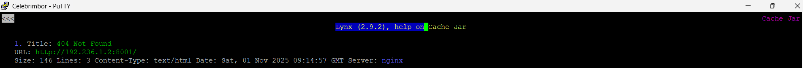
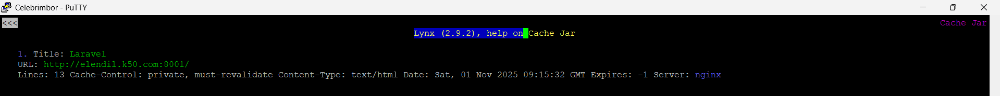
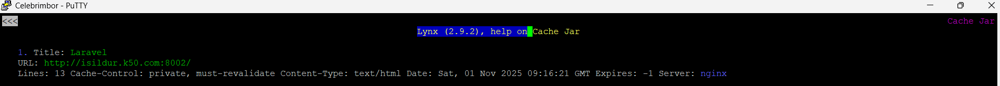
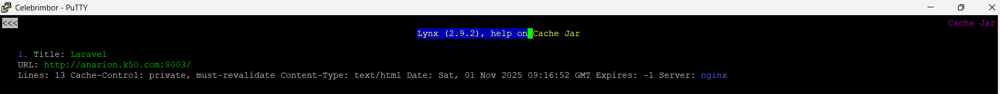
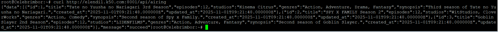

# Jarkom-Modul-3-2025-K50    
| Nama                    | NRP        |
| ----------------------- | ---------- |
| Rayka Dharma Pranandita | 5027241039 |
| Yasykur Khalis J M Y    | 5027241112 |

# Prefix IP

| Kelompok | Prefix IP |
| -------- | --------- |
| K-50     | 192.236   |

## Soal 1
## Soal 7
Run solver `/root/soal_7.sh` di worker (node *Elendil, Isildur & Anarion*) dan jangan lupa melakukan script `/root/soal_6.sh` (berbeda dari script aldarion, ini untuk mengubah nameserver ke yang terbaru: *192.236.3.2* & *192.236.3.3*) untuk merubah nameserver pada (node *Elendil, Isildur, Anarion, Miriel/Celebrimbor & Elros*). <br>    

Pengecekan bisa dilakukan dengan command `lynx` untuk tiap IP yang meliputi:
- *Elendil*
```bash
lynx http://192.236.1.2:8001
```      
-  *Isildur*
```bash
lynx http://192.236.1.3:8002
```
-  *Anarion*
```bash
lynx http://192.236.1.4:8003
```    
Hasil cek salah satu website:     

<br>
## Soal 8
Run solver `/root/soal_8.sh` di node *Palantir* lalu run solver `/root/soal_8.sh` untuk tiap node worker (*Elendil, Isildur & Anarion*), isi data pada solver sesuai dengan detail node worker:   
```bash
# Contoh isi kredensial (sesuaikan dengan node)
Masukkan DOMAIN LENGKAP worker ini (e.g., elendil.k50.com): isildur.k50.com
Masukkan PORT Nginx worker ini (e.g., 8001): 8002
Masukkan NAMA DATABASE (e.g., dbkelompokyyy): db_k50
Masukkan USERNAME DATABASE (e.g., kelompokyyy): user_k50
Masukkan PASSWORD DATABASE: pass_k50
```
## Soal 9
Melakukan test `lynx` dan `curl` pada website:
- lynx
  - IP Worker:   
    - *192.236.1.2:8001*:<br>
    
    - *192.236.1.3:8002*:<br>
    
    - *192.236.1.4:8003*:<br>
    
    <br>
  - Domain Worker:
    - *elendil.k50.com:8001*:<br>
      
      <br>
    - *isildur.k50.com:8002*:<br>
      
      <br>
    - *anarion.k50.com:8003*:<br>
      
- Curl:     
  ***NOTE: Jika saat curl message: "succeed" namun data kosong, coba untuk melakukan step ini di Elendil:***   
  ```bash
  cd /var/www/laravel-simple-rest-api
  php artisan migrate:fresh
  php artisan db:seed --class=AiringsTableSeeder
  ```    
  Hasil pengujian:    
  

## Soal 10