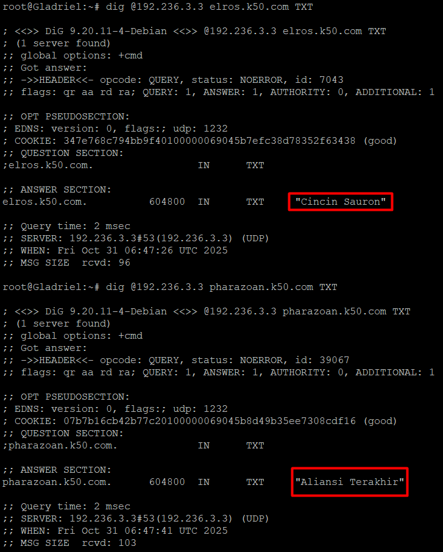

# Jarkom-Modul-3-2025-K50    
| Nama                    | NRP        |
| ----------------------- | ---------- |
| Rayka Dharma Pranandita | 5027241039 |
| Yasykur Khalis J M Y    | 5027241112 |

# Prefix IP

| Kelompok | Prefix IP |
| -------- | --------- |
| K-50     | 192.236   |

## Soal 1
Buat Topologi

Kosongkan `resolv.conf` dan pastikan Durin (router) hanya meneruskan paket:
```bash
rm /etc/resolv.conf
touch /etc/resolv.conf

sysctl -w net.ipv4.ip_forward=1
```
Lalu coba ping di salah satu host, pastikan berhasil.
## Soal 2
Di Aldarion (DHCP Server):

Install DHCP Server:
```bash
apt update -y
apt install -y isc-dhcp-server
```

Konfigurasi `dhcpd.conf`:
```bash
default-lease-time 600;
max-lease-time 7200;
authoritative;

# Subnet 1 (Human Clients)
subnet ${PREFIX}.1.0 netmask 255.255.255.0 {
  range ${PREFIX}.1.6 ${PREFIX}.1.34;
  range ${PREFIX}.1.68 ${PREFIX}.1.94;
  option routers ${PREFIX}.1.1;
  option broadcast-address ${PREFIX}.1.255;
  option domain-name-servers ${DNS_MASTER};
}

# Subnet 2 (Elf Clients)
subnet ${PREFIX}.2.0 netmask 255.255.255.0 {
  range ${PREFIX}.2.35 ${PREFIX}.2.67;
  range ${PREFIX}.2.96 ${PREFIX}.2.121;
  option routers ${PREFIX}.2.1;
  option broadcast-address ${PREFIX}.2.255;
  option domain-name-servers ${DNS_MASTER};
}

# Subnet 3 (Database / Fixed)
subnet ${PREFIX}.3.0 netmask 255.255.255.0 {
  # Fixed address for Khamul
  host khamul {
    hardware ethernet 02:42:04:df:0f:00;  # MAC address Khamul
    fixed-address ${PREFIX}.3.95;
  }
  option routers ${PREFIX}.3.1;
  option broadcast-address ${PREFIX}.3.255;
  option domain-name-servers ${DNS_MASTER};
}

# Subnet ke-4 (link ke Minastir / Forward Proxy)
subnet 192.236.4.0 netmask 255.255.255.0 {
  # Semua host statis (Aldarion, Palantir, Narvi)
  option routers 192.236.4.1;
  option broadcast-address 192.236.4.255;
  option domain-name-servers 192.236.4.2;
}
```

Di Durin (dhcp relay):

install `isc-dhcp-relay` dan konfigurasi:
```bash
SERVERS="192.236.4.2"
INTERFACES="eth1 eth2 eth3 eth4"
OPTIONS=""
```

Cek dengan `dhclient` di host lain:


## Soal 3
Di Minastir(DNS Forwarder), install bind9 dan konfigurasi:

`/etc/bind/named.conf.options`
```bash
options {
    directory "/var/cache/bind";

    forwarders {
        192.168.122.1;
    };

    allow-query { any; };
    listen-on { any; };
    recursion yes;
};
```

Atur ulang `resolv.conf` untuk menggunakan `nameserver 127.0.0.1` dan jalankan bind9 dengan:
```bash
service named restart
```

Uji coba di Minastir harus me-return `127.0.0.1`:


Dan uji coba di host lain harus me-return ip address Minastir:


## Soal 4
Erendis sebagai DNS Master:

`/etc/bind/named.conf.options`:
```bash
options {
    directory "/var/cache/bind";

    // Listening ke semua interface
    listen-on port 53 { any; };
    listen-on-v6 { none; };

    // Izinkan query dari subnet internal
    allow-query { 192.236.0.0/16; };

    recursion yes;
    auth-nxdomain no; // prevent empty zones warning

    forwarders { 192.168.122.1; };
};
```

`/etc/bind/named.conf.local`:
```bash
zone "k50.com" {
    type master;
    file "/etc/bind/zones/k50.com";
    allow-transfer { 192.236.3.3; }; // Amdir
};
```

`/etc/bind/zones/k50.com`:
```bash
$TTL    604800
@   IN  SOA ns1.k50.com. admin.k50.com. (
        2025102801 ; Serial
        604800     ; Refresh
        86400     ; Retry
        2419200   ; Expire
        604800 ) ; Negative Cache TTL

@   IN  NS  ns1.k50.com.
@   IN  NS  ns2.k50.com.

ns1             IN  A   192.236.3.2
ns2             IN  A   192.236.3.3

palantir    IN  A   192.236.4.3
elros       IN  A   192.236.1.6
pharazon    IN  A   192.236.2.2
elendil     IN  A   192.236.1.2
isildur     IN  A   192.236.1.3
anarion     IN  A   192.236.1.4
galadriel   IN  A   192.236.2.6
celeborn    IN  A   192.236.2.5
oropher     IN  A   192.236.2.4
```

Di Amdir (DNS Slave):

`/etc/bind/named.conf.options`:
```bash
options {
    directory "/var/cache/bind";

    listen-on port 53 { any; };
    listen-on-v6 { none; };
    allow-query { 192.236.0.0/16; };
    recursion yes;
};
```

`/etc/bind/named.conf.local`:
```bash
zone "k50.com" {
    type slave;
    masters { 192.236.3.2; }; # Erendis
    file "/etc/bind/zones/k50.com";
};
```

Lalu restart bind9 di Erendis dan Amdir dengan named

Uji coba dengan `dig` ip address Erendis dan Amdir dan nama domain yang ada di konfigurasi:


## Soal 5
Di Erendis:

Tambahkan:
```bash
; Alias
www         IN  CNAME $DOMAIN.

; TXT records (pesan rahasia)
elros       IN  TXT "Cincin Sauron"
pharazoan   IN  TXT "Aliansi Terakhir"
```
di `/etc/bind/zones/k50.com`

Lalu restart bind9

Uji coba dengan argumen `TXT` dan flag `-x`:




## Soal 6

Tambahkan:
```bash
max-lease-time 3600;
default-lease-time 1800; # Untuk Subnet Manusia
default-lease-time 600; # Untuk Subnet Peri
```

Di `/etc/dhcp/dhcpd.conf`

Uji coba dengan `cat /var/lib/dhcp/dhcpd.leases` di server:


di client:
```bash
dhclient -r && dhclient -v
cat /var/lib/dhcp/dhclient.leases
```


## Soal 7
Run solver `/root/soal_7.sh` di worker (node *Elendil, Isildur & Anarion*) dan jangan lupa melakukan script `/root/soal_6.sh` (berbeda dari script aldarion, ini untuk mengubah nameserver ke yang terbaru: *192.236.3.2* & *192.236.3.3*) untuk merubah nameserver pada (node *Elendil, Isildur, Anarion, Miriel/Celebrimbor & Elros*). <br>    

Pengecekan bisa dilakukan dengan command `lynx` untuk tiap IP yang meliputi:
- *Elendil*
```bash
lynx http://192.236.1.2:8001
```      
-  *Isildur*
```bash
lynx http://192.236.1.3:8002
```
-  *Anarion*
```bash
lynx http://192.236.1.4:8003
```    
Hasil cek salah satu website:     

<br>
## Soal 8
Run solver `/root/soal_8.sh` di node *Palantir* lalu run solver `/root/soal_8.sh` untuk tiap node worker (*Elendil, Isildur & Anarion*), isi data pada solver sesuai dengan detail node worker:   
```bash
# Contoh isi kredensial (sesuaikan dengan node)
Masukkan DOMAIN LENGKAP worker ini (e.g., elendil.k50.com): isildur.k50.com
Masukkan PORT Nginx worker ini (e.g., 8001): 8002
Masukkan NAMA DATABASE (e.g., dbkelompokyyy): db_k50
Masukkan USERNAME DATABASE (e.g., kelompokyyy): user_k50
Masukkan PASSWORD DATABASE: pass_k50
```
## Soal 9
Melakukan test `lynx` dan `curl` pada website:
- lynx
  - IP Worker:   
    - *192.236.1.2:8001*:<br>
      
    - *192.236.1.3:8002*:<br>
      
    - *192.236.1.4:8003*:<br>
      
    <br>
  - Domain Worker:
    - *elendil.k50.com:8001*:<br>
      
      <br>
    - *isildur.k50.com:8002*:<br>
      
      <br>
    - *anarion.k50.com:8003*:<br>
      
- Curl:     
  ***NOTE: Jika saat curl message: "succeed" namun data kosong, coba untuk melakukan step ini di Elendil:***   
  ```bash
  cd /var/www/laravel-simple-rest-api
  php artisan migrate:fresh
  php artisan db:seed --class=AiringsTableSeeder
  ```    
  Jika sudah melakukan command tersebut bisa melakukan curl ke masing masing endpoint dengan command `curl http://[IP Worker]:[port worker]/api/airing`    
  <br> Hasil pengujian:    
  

## Soal 10
Run solver `/root/soal_10.sh` di node *Elros*, selanjutnya run solver `/root/soal_10.sh` di node worker (*Elendil, Isildur, Anarion*), jika sudah selesai bisa melakukan pengujian `curl` melalui node *Miriel* atau *Celebrimbor* dengan command `curl elros.k50.com/api/airing`
